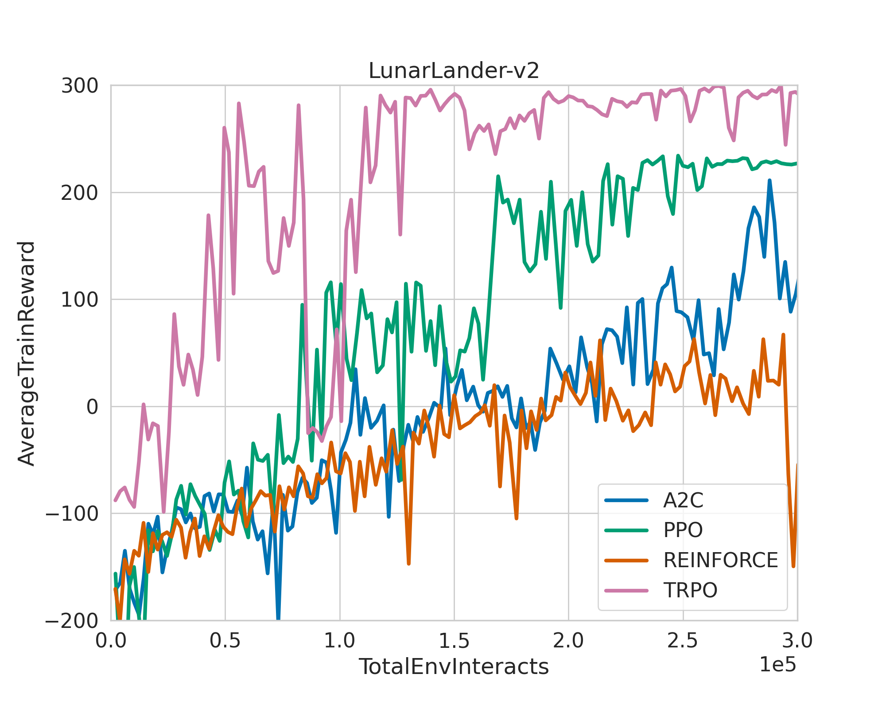

# reRLs
A collection of RL papers reproduced by mantle 2048

| RL algorithms | EA algorithms|
| --------------- | -------------- |
| :heavy_check_mark: Vanilla PG | :heavy_check_mark: OpenAI ES |
| :heavy_check_mark:       A2C  | :x:                   CMA-ES |
| :heavy_check_mark:       NPG  | :x:                     PEPG |
| :heavy_check_mark:       TRPO | :x:                       GA |
| :heavy_check_mark:       PPO  | :x:                      CEM |
| :x: DDPG                      |                              |
| :x: TD3                       |                              |
| :x: SAC                       |                              |

